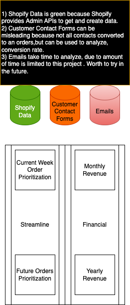

# capstone-project-proposal-yavuz-bmd

My wife owns a business(organicbakeryaustin.com), she bake custom cakes for events in Austin,Texas. 
I have built the platforms for her to sell and display her products in Shopify. We have fulfilled and upcoming orders that needs to be analyzed. My purpose is to build pipelines to run analytics on orders data. This data will come through Shopify GraphQL APIs, and analayzed in AWS platform. Currently, we have a static website in S3 that is available only for us to see orders details, that is using API Gateways to trigger AWS Lambda functions, to run simple analytics. But the problem is I want to run complex analytics on them, so I need to create a data warehouse and built data pipelines on top of it. That will be my capstone project.

The actual code is in my personal repository. The reason i want to use that is there is already setup prod env, and in use. I want to improve it with the new strategies I learned in this course. Below is the link.

https://github.com/yvznmn/bake_my_day_modules

python3 -m venv venv
source venv/bin/activate

Install Necessary Libraries
pip install pyspark==3.2.1
pip install delta-spark==1.2.1

export PYTHONPATH="${PYTHONPATH}:<YOUR_PROJECT_ROOT>"
export AWS_ACCESS_KEY_ID=<AWS_ACCESS_KEY_ID>
export AWS_SECRET_KEY=<AWS_SECRET_ACCESS_KEY>

In order to generate data

cd test_data
python -c "from generate_data import <function_name>; <function_name>(<params_if_any>)"

AWS REdshift Serverless

create delta table
create glue database
create glue delta table
load with spark
create external schema in redshift spectrum, setup iam roles(provide s3 and glue access) for it

Create your DW
provide necessary security inbound rules for the REdshift port and proper IP
provide necessary VPC Network ACL inbound rules for the REdshift port and proper IP

dbt settup

dbt init <dbt_folder_name>, pick redshift and finish questioneer

dbt debug

Redshift

CREATE SCHEMA IF NOT EXISTS <schema_name>;

export AIRFLOW_HOME=<airflow_home>
airflow db init
airflow users create \
   --username admin \
   --firstname FIRST_NAME \
   --lastname LAST_NAME \
   --role Admin \
   --email admin@example.com
# start the server on backend
nohup airflow webserver -D &
# Stop the current scheduler process (if running)
pkill -f "airflow scheduler"
pkill -f "airflow webserver"
# Start the scheduler again
nohup airflow scheduler &

ps aux | grep airflow

brew install postgresql
brew services start postgresql@14
# Open the db
psql postgres
CREATE ROLE <USER_NAME> WITH LOGIN PASSWORD '<PWD>';
ALTER ROLE <USER_NAME> CREATEDB;
# Quits Db
\q 
psql postgres -U admin

CREATE DATABASE airflow;
GRANT ALL PRIVILEGES ON DATABASE airflow TO <USER_NAME>;
\q
brew services stop postgresql@14

pip install 'apache-airflow[postgres]'

**CONCEPTUAL MODELING**

